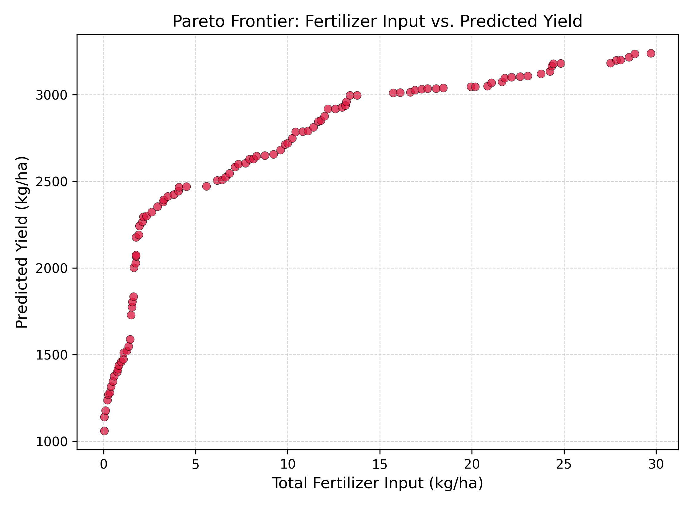
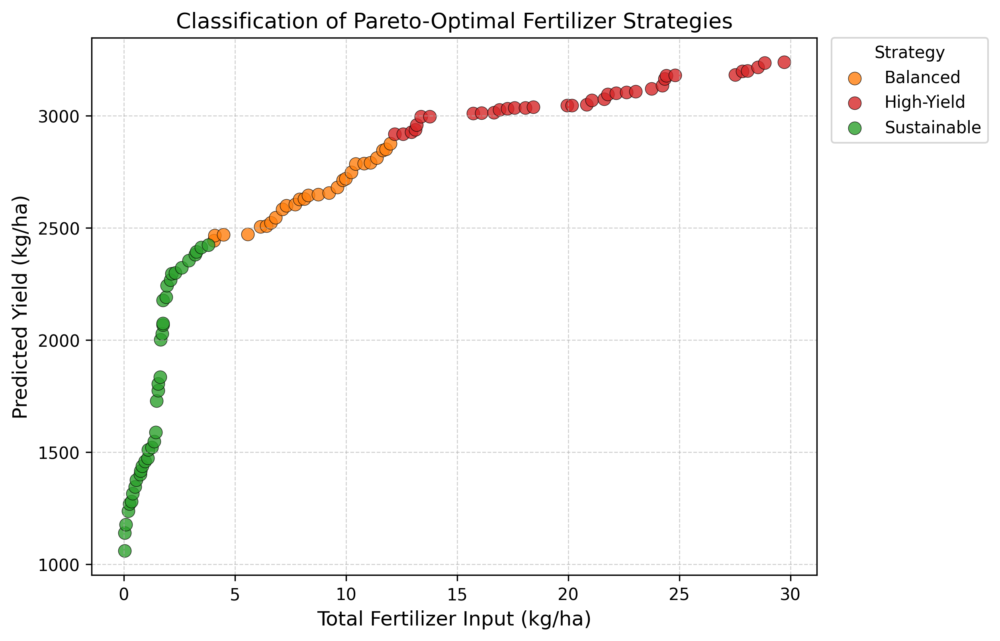

# AI-Driven Fertilizer Optimization for Sustainable Soybean Production in Brazil

This repository presents a master's research project on reducing chemical fertilizer overuse in agriculture with machine learning and multi-objective optimization. The study models soybean yield in Brazil from historical N, P2O5, and K2O fertilizer application data, then uses scenario analysis and NSGA-II optimization to identify fertilizer strategies that balance yield and sustainability.

## Associated Paper

This work accompanies the conference paper available on IEEE Xplore:

[IEEE Xplore document 11367605](https://ieeexplore.ieee.org/abstract/document/11367605)

The public repository does not include the publisher PDF by default. See [docs/paper.md](docs/paper.md) for citation details and manuscript access notes.

## Research Focus

- Country: Brazil
- Crop: Soybean
- Period: 1961-2019
- Inputs: Nitrogen (N), phosphorus (P2O5), potassium (K2O)
- Target: Soybean yield in kg/ha
- Methods: Random Forest, XGBoost, Linear Regression, scenario simulation, NSGA-II optimization

## Repository Structure

```text
.
|-- data/
|   |-- processed/      # Small derived CSVs used in analysis
|   |-- sample/         # Reserved for small examples
|   `-- README.md       # Data source and regeneration notes
|-- docs/
|   |-- methodology.md
|   |-- results_summary.md
|   |-- data_sources.md
|   `-- paper.md
|-- results/
|   |-- figures/        # Curated final figures
|   `-- tables/         # Reserved for final public tables
|-- scripts/            # Reproducible workflow scripts
|-- artifacts/          # Ignored generated outputs and local model files
|-- requirements.txt
|-- README.md
|-- LICENSE
`-- .gitignore
```

## Setup

```powershell
python -m venv .venv
.\.venv\Scripts\Activate.ps1
pip install -r requirements.txt
```

Some geospatial dependencies, especially `rasterio` and `geopandas`, may need platform-specific wheels or Conda on Windows if pip installation fails.

## Reproduction Workflow

Run scripts from the repository root:

```powershell
python scripts/01_prepare_data.py
python scripts/02_train_models.py
python scripts/03_optimize_fertilizer.py
python scripts/04_scenario_analysis.py
python scripts/05_strategy_recommender.py
python scripts/06_generate_figures.py
```

Raw GeoTIFF and FAOSTAT inputs are not tracked in Git because they are large external datasets. The repository includes small processed CSVs under `data/processed/`, so the modeling, optimization, strategy, and figure-generation stages can be inspected without uploading the raw 7 GB raster folder.

## Model Results

| Model | R2 | RMSE | MAE |
|---|---:|---:|---:|
| Linear Regression | 0.807 | 359.08 | 322.27 |
| Random Forest | 0.948 | 186.33 | 166.33 |
| XGBoost | 0.934 | 210.72 | 178.42 |

Random Forest produced the strongest predictive performance and was used as the main model for fertilizer optimization experiments.

## Key Findings

- K2O showed the strongest yield-responsive behavior in the modeled soybean system.
- Nitrogen and P2O5 reduction scenarios showed limited predicted yield loss in the tested range.
- NSGA-II produced a Pareto frontier of fertilizer strategies, making the trade-off between total input and predicted yield explicit.
- The workflow supports sustainable, balanced, and high-yield fertilizer strategy categories.

## Selected Figures






