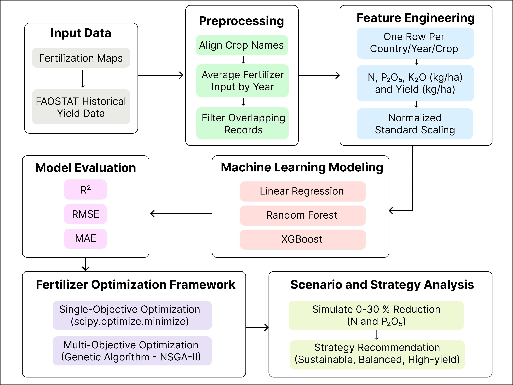
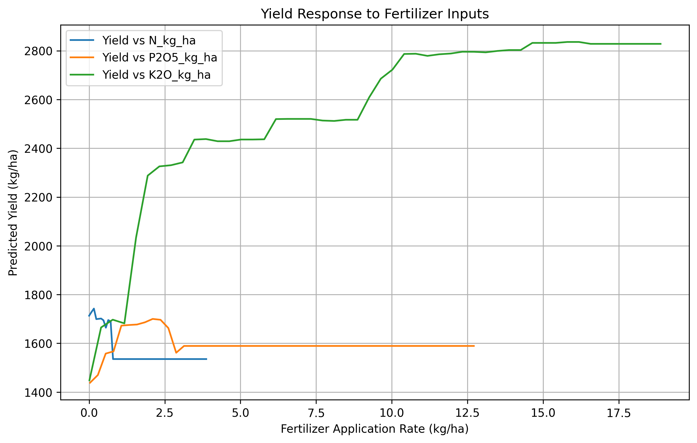
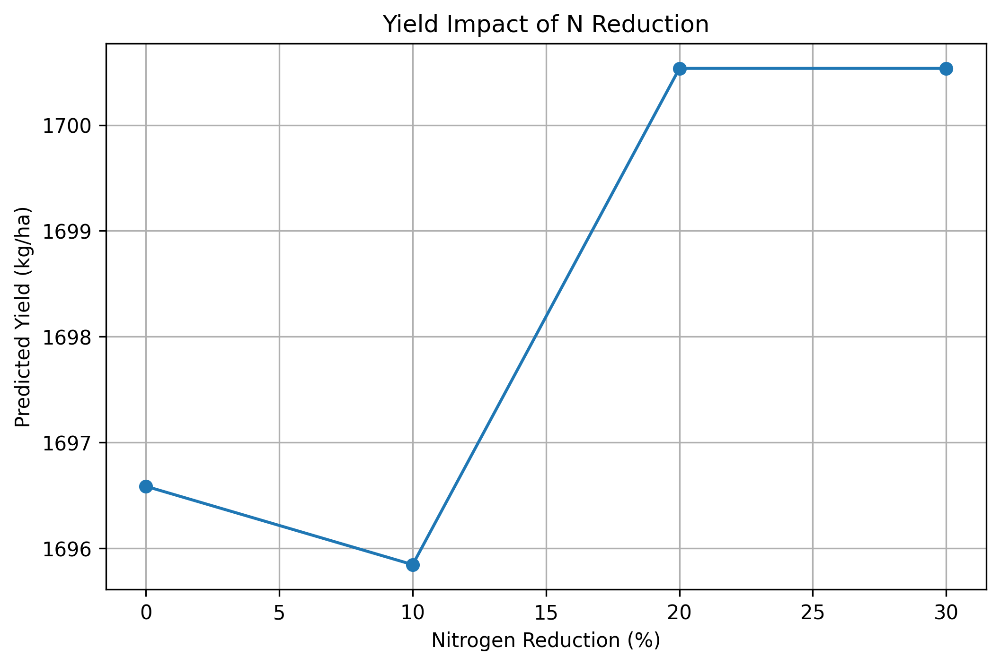
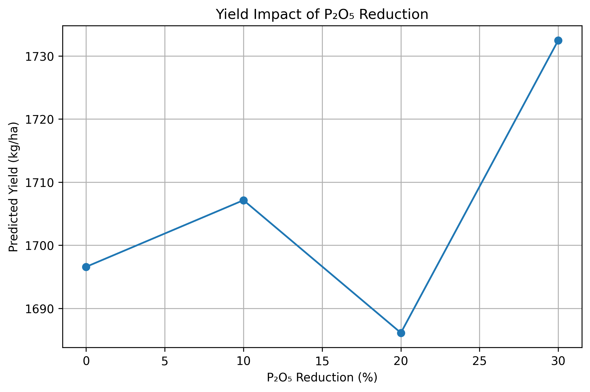
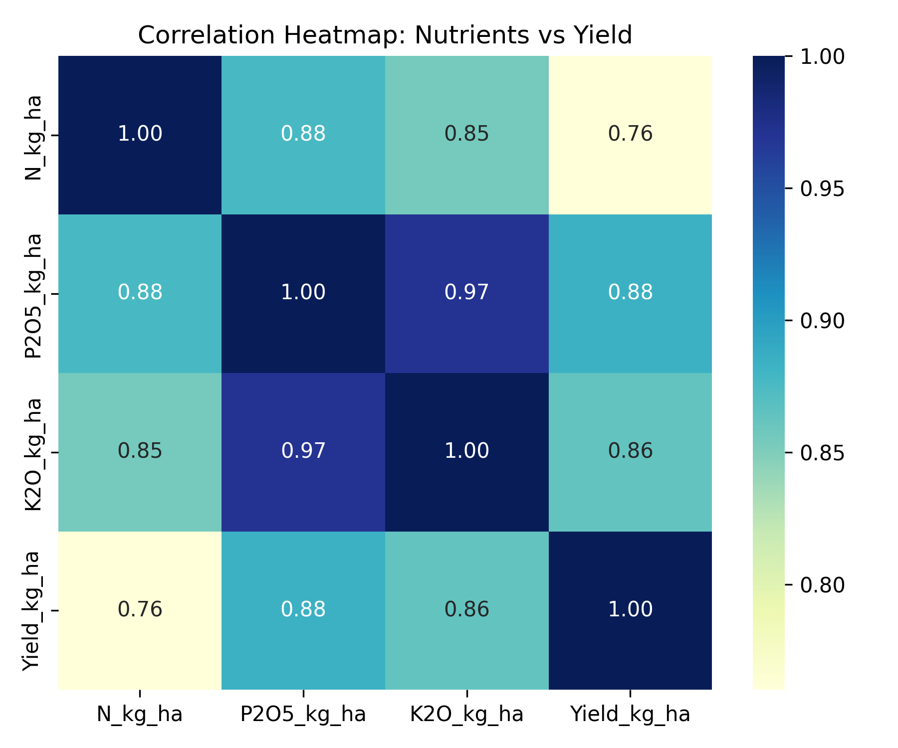
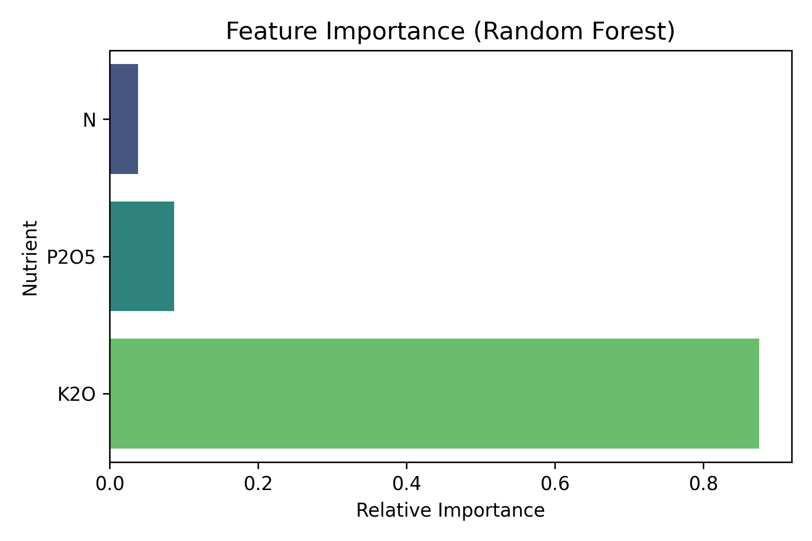

# AI-Based Fertilizer Optimization Using Random Forests and NSGA-II for Soybean Yield in Brazil

This repository presents a master's research project on reducing chemical fertilizer overuse in agriculture with machine learning and multi-objective optimization. The study integrates crop-specific fertilizer application maps with FAOSTAT soybean yield records for Brazil, trains a Random Forest yield model, and embeds that model inside NSGA-II to identify fertilizer strategies that balance productivity and sustainability.

## Associated Paper

This repository accompanies the STI 2025 conference paper available on IEEE Xplore:

[IEEE Xplore document 11367605](https://ieeexplore.ieee.org/abstract/document/11367605)

The public repository does not include the publisher PDF by default. See [docs/paper.md](docs/paper.md) for citation details and manuscript access notes.

## Research Focus

- Country: Brazil
- Crop: Soybean
- Period: 1961-2019
- Inputs: Nitrogen (N), phosphorus (P2O5), potassium (K2O)
- Target: Soybean yield in kg/ha
- Methods: Random Forest regression, Linear Regression, XGBoost, NSGA-II optimization, scenario simulation, strategy zoning

## Repository Structure

```text
.
|-- data/
|   |-- processed/      # Small derived CSVs used in analysis
|   |-- sample/         # Reserved for small examples
|   `-- README.md       # Data source and regeneration notes
|-- docs/
|   |-- methodology.md
|   |-- results_summary.md
|   |-- data_sources.md
|   `-- paper.md
|-- results/
|   |-- figures/        # Curated final figures
|   `-- tables/         # Reserved for final public tables
|-- scripts/            # Reproducible workflow scripts
|-- artifacts/          # Ignored generated outputs and local model files
|-- requirements.txt
|-- README.md
|-- LICENSE
`-- .gitignore
```

## Setup

```powershell
python -m venv .venv
.\.venv\Scripts\Activate.ps1
pip install -r requirements.txt
```

Some geospatial dependencies, especially `rasterio` and `geopandas`, may need platform-specific wheels or Conda on Windows if pip installation fails.

## Reproduction Workflow

Run scripts from the repository root:

```powershell
python scripts/01_prepare_data.py
python scripts/02_train_models.py
python scripts/03_optimize_fertilizer.py
python scripts/04_scenario_analysis.py
python scripts/05_strategy_recommender.py
python scripts/06_generate_figures.py
```

Raw GeoTIFF and FAOSTAT inputs are not tracked in Git because they are large external datasets. The repository includes small processed CSVs under `data/processed/`, so the modeling, optimization, strategy, and figure-generation stages can be inspected without uploading the raw 7 GB raster folder.

The optimization script defaults to the paper's NSGA-II settings: population size 100, 200 generations, and random seed 42. For a faster local smoke test, set `NSGA2_POPULATION` and `NSGA2_GENERATIONS` before running `scripts/03_optimize_fertilizer.py`.

## Model Results

Paper-reported model performance:

| Model | R2 | RMSE | MAE |
|---|---:|---:|---:|
| Linear Regression | 0.807 | 359.08 | 322.27 |
| XGBoost Regressor | 0.934 | 210.72 | 178.42 |
| Random Forest | 0.951 | 181.95 | 163.84 |

Random Forest produced the strongest predictive performance and was used as the surrogate model for the single-objective optimization, NSGA-II Pareto search, nutrient-reduction simulations, and strategy recommender.

## Key Findings

- Single-objective optimization could not satisfy the 90th percentile yield target of 2932.3 kg/ha, suggesting a biological or data-imposed ceiling in the national aggregate dataset.
- NSGA-II produced a Pareto frontier showing that incremental yield gains require disproportionately higher nutrient inputs.
- N and P2O5 showed near-plateau responses; the paper reports that up to 30% reductions can be explored with limited predicted yield loss, especially when K2O is managed carefully.
- Pearson correlation ranked P2O5 highest in linear association with yield, while Random Forest feature importance identified K2O as the dominant nonlinear predictor.
- Pareto-optimal solutions were organized into sustainable, balanced, and high-yield strategy zones for decision support.

## Paper Figures

The figures below follow the paper's figure order.

**Fig. 1. Methodology pipeline**



**Fig. 2. Yield response curves**



**Fig. 3. NSGA-II Pareto frontier**


**Fig. 4. N reduction scenario**



**Fig. 5. P2O5 reduction scenario**



**Fig. 6. Strategy zones**


**Fig. 7. Pearson correlation matrix**



**Fig. 8. Random Forest feature importance**


